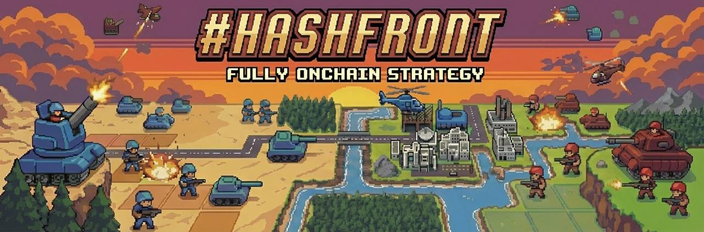

# Hashfront



Turn-based tactics game on Starknet. Two to four players command armies on a grid, taking alternating turns to outmaneuver each other — inspired by Advance Wars.

## Monorepo Structure

```
hashfront/
├── client/          # React + PixiJS + Vite frontend
├── server/          # Hono API + AI agent backend
├── contracts/       # Dojo contracts (Cairo) — models, systems, tests
├── tools/           # Balance simulator and analysis tools
├── PRD.md
├── AGENTS.md
└── README.md
```

## How It Works

```
Player 1's Turn → Player 2's Turn → ... → Player N's Turn → Round increments → ...
```

Each turn: move units → attack/capture/build → end turn. Simple, strategic, no hidden information.

## Game

- **Configurable grid** with Grass, Mountains, Cities, Factories, Roads, Trees, and HQs
- **2–4 players** on fixed symmetrical maps registered on-chain
- **3 unit types** — Infantry (fast capturer), Tank (heavy hitter), Ranger (ranged support, can capture)
- **Economy** — Capture cities for income, build units at factories
- **Win** by capturing the enemy HQ, elimination, or highest score after 100 rounds
- **AI agents** — Real on-chain players with personality traits; bluff, negotiate, and influence them mid-game via chat
- **Tactical Blueprint aesthetic** — CRT scanlines, blueprint grid, retro military terminal vibe

## Development

```bash
# Install all dependencies
pnpm install

# Client env (Torii GraphQL endpoint)
export VITE_TORII_GRAPHQL_URL=https://api.cartridge.gg/x/hashfront/torii/graphql

# Run client (port 5173)
pnpm dev:client

# Run server (port 3001)
pnpm dev:server

# Run both
pnpm dev
```

## Stack

- **Chain**: Starknet + Dojo
- **Client**: React + PixiJS + Vite
- **Server**: Hono + TypeScript
- **Wallet**: Cartridge Controller (session keys)
- **AI**: OpenRouter LLM + controller-cli for on-chain agent txs
- **Indexer**: Torii (gRPC subscriptions)

## License

MIT
