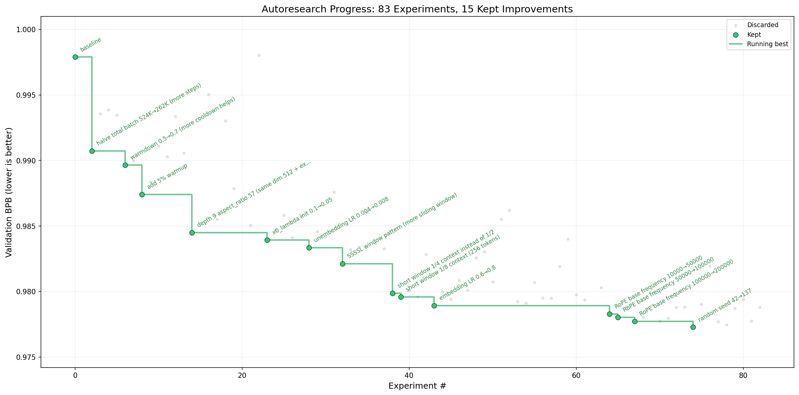

# autoresearch



This directory is a Hashfront policy-training sandbox. It runs reinforcement learning experiments against the live headless simulator in [`../tools/simulator.py`](../tools/simulator.py) using the real maps in `contracts/scripts/maps/`.

## What changed

The training code now targets the current simulator API instead of the older local assumptions:

- It imports the simulator from the repo’s `tools/` directory.
- It uses the current unit roster and combat model, including `ARTILLERY`.
- It trains against the real map pool and heuristic strategy ensemble shipped with Hashfront.

## How it works

- `train.py` contains the policy network, action generation, reward shaping, and the 5-minute training loop.
- `program.md` is the prompt/instructions file for an autonomous agent iterating on `train.py`.
- `analysis.ipynb` and the legacy upstream files are optional scratch space; they are not required to run simulator training.

Each run keeps the 300-second wall-clock budget and prints `Final win rate: X.XXXX` at the end.

## Quick start

Requirements: Python 3.10+, `uv`, and a working PyTorch install. CUDA is preferred, but the code falls back to CPU.

```bash
cd autoresearch
uv sync
uv run train.py
```

To push more simultaneous games through the policy and make CUDA more useful, raise the rollout fanout:

```bash
uv run train.py --parallel-envs 8
```

The training script will:

- Enumerate the current Hashfront maps from `contracts/scripts/maps/`
- Bootstrap against a randomized ensemble of `Aggressive`, `Defensive`, `Rush`, and `Balanced`
- Promote frozen policy snapshots into a small self-play league and sample them as future opponents
- Train for 5 minutes
- Evaluate the best checkpoint in the remaining time budget

## Layout

```text
train.py        policy/value network and training loop
program.md      agent instructions for autonomous iteration
README.md       local usage notes for Hashfront training
```

## Notes

- `prepare.py` comes from the upstream autoresearch scaffold and is not part of the Hashfront simulator loop.
- If simulator rules change again, update `train.py` against `tools/simulator.py` first, then refresh `program.md` so the agent prompt matches reality.
